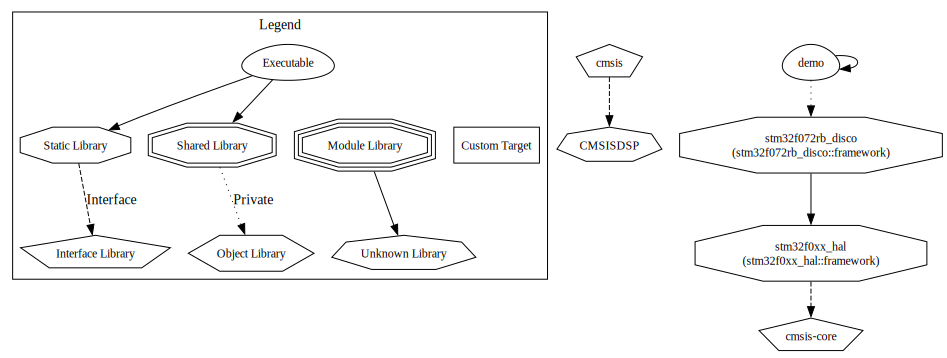

# STM32F072RB-DISCO
This is a STM32F072 Discovery board with CMake

## HAL
The STM32F072RB is driven with the HAL drivers extracted from the `f0` variant defined in the CMake variable `STM32_TYPE` to be enforced upon by the cmake-toolchain silicon type.

The `STM32CubeMx` is used only to bring the board up and is used in the `hal_core` definitions. Thus the board clocks, peripheral clocks, GPIO Pins and driver level configuration are performed by `STM32CubeMx`.

## Startup and Interrupt Vectors
The standard startup and interrupt vectors are not used by this project, instead a modern `C` based approach is done. Thus there are no assembly files in the project.

## Hardware Resources

* Timer 14: CANopenNode STM32 CAN Timer for 1ms
* Timer 17: HAL Time base 1ms

* SysTick is unused.
## Demo application
The demo.c file implements two functions, `app_main` and timer 14 timer complete callback.

The application:
* Makes the timer 14 to interupt at every 1 ms.
* Timer 14 ISR ends with the callback that is toggling the `Blue LED` of the Discovery board every 1kHz.
* Timer 17 (HAL Time base) is setup to trigger a 1kHz period.
* `Red LED` is toggled every 20 ms using the HAL Delay to ensure the HAL time base is correctly configured.

## Overall architecture
The below is generated by CMake using graphviz

